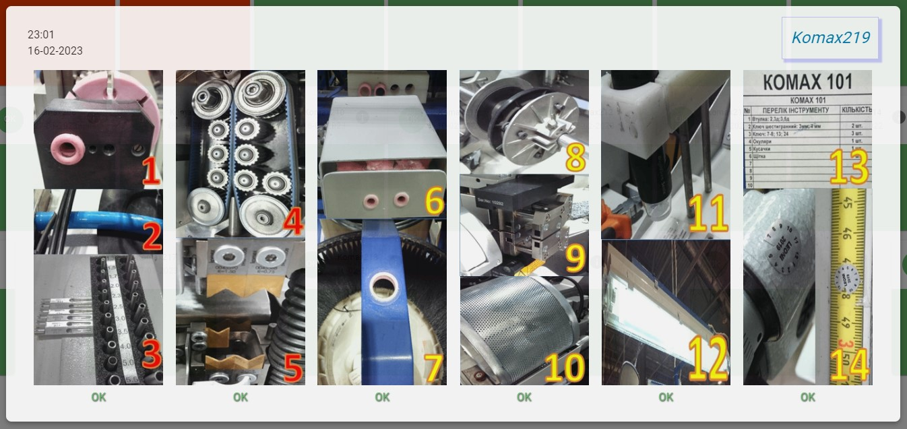
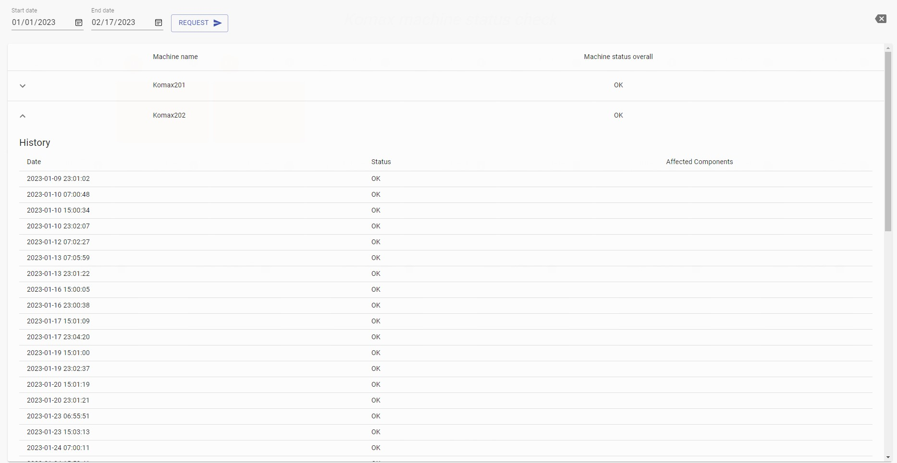
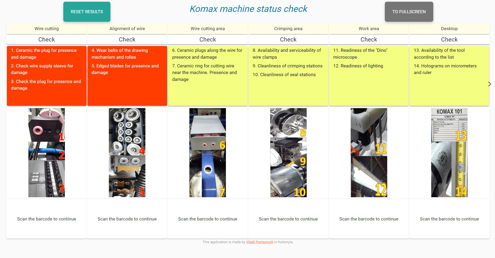

# komax-flags
Main goal of the application is ensuring proper condition of cutting machines and providing base level of failure statistic, it is design to use with Komax cutting machines but could be used in any production process.

The app could be configured by editing **config.php** file and set the database connection parameters

This app is currently works:
- at both ukrainian Leoni plants
- at the Leoni plant in Kraljevo, Serbia
- the launch is being prepared at the Leoni Merida2 plant in Mexico

This repository contaign only compiled version of the app, please contact me if you like to get the source code
